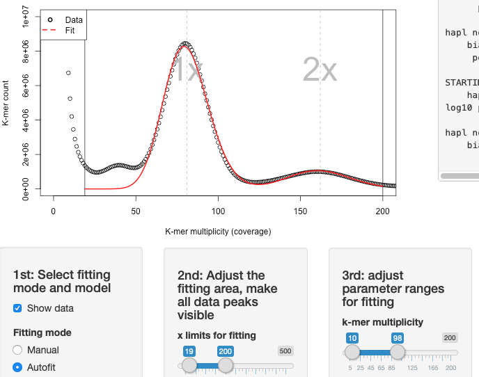
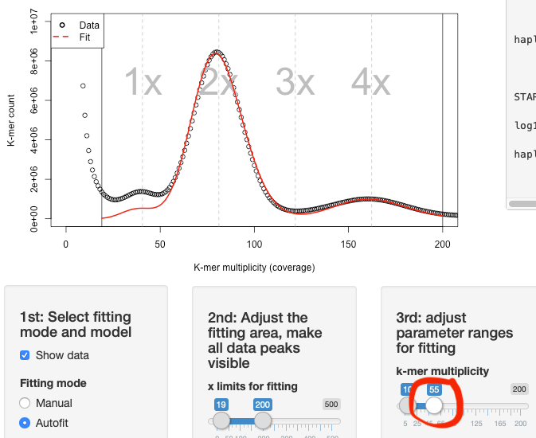

# TETMER – FITTING PARAMETERS TO K-MER SPECTRA OF ALLOTETRAPLOIDS*

*plus autotetraploids, triploids, and diploids

Tetmer is an R pacakge relying on the R base package and shiny for visualisation. It was originally developed for the paper “Maintenance of species differences in closely related tetraploid parasitic *Euphrasia* (Orobanchaceae) on an isolated island” by [Becher et al. 2020 *Plant Communications*](https://doi.org/10.1016/j.xplc.2020.100105). The equations for the k-mer patterns were derived using the bSFS approach by Lohse et al. (2011, 2016).

## Setup
1.	Download the [latest release here](https://github.com/hannesbecher/shiny-k-mers/releases/download/v2.1.0/Tetmer_2.1.0.tar.gz).
2.	Open Rstudio and run `install.packages("path/to/Tetmer_2.1.0.tar.gz", repo=NULL)`.
3.	To see if it works run `library(Tetmer)` and then `tetmer(E028)`. An interactive window should pop up.

## Using Tetmer (brief)
To use the interactive app, do this:
1.	Load the Tetmer package `library(Tetmer)`
2.	Import your data: `mySpec = read.spectrum("path/to/mySpectrumTextFile", "myCustomNameForPlotting")`
3.	Run the Tetmer app: `tetmer(mySpec)`

If you want to familiarise yourself with the interface, try running Tetmer on an example data set like `tetmer(E028)` (an allotetraploid plant called *Euphrasia arctica*) or `tetmer(E030)` (a diploid plant called *Euphrasia anglica*).

If you only want to plot your data, try `plot(mySpec, log="xy")` or something like `plot(mySpec, xlim=c(0, 200), ylim=c(0, 10000000))`. The log-scale plot has the advantage that it captures all the data. The second (linear) plot is easier to interpret, but you may have to adjust the axis limits for your data.

## Format and data requirements
Tetmer was originally developed for k-mer spectrum files as produced by KAT (Mapleson et al., 2016). These have a header of lines starting with `#` (R’s default comment character), which will be ignored by Tetmer. The actual k-mer spectrum is represented by two columns (multiplicity and k-mer count), which are separated by a single space. While the KAT default is to start at multiplicity 1, Tetmer should handle 0-based files, too. Because Tetmer does not attempt to estimate the full genome size, k-mer files can be truncated.

Tetmer is intended for k-mer spectra generated from shotgun sequencing data of *single individuals*.

## Using Tetmer (more detail)

### Auto fitting
Most users will probably be interested in quickly fitting parameters to their data. In this case, select *Autofit* in the first control panel. The program will try to minimise the difference between the data (black circles) and the fit (red line). Most k-mer spectra have a *contamination peak* (going up the y-axis). This part of the spectrum *should be excluded* using the top slider in panel two (left handle), because it would otherwise cause a large unaccountable difference between data and model. The other end of the same slider should be set high enough to include all relevant peaks of the spectrum (roughly, ploidy times haploid sequencing coverage).

Use the bottom slider in panel 2 to adjust the *y-axis* (this is for visualisation only and will not affect the fit.)

Now you can set the range for the *genome parameters* in panel 3. Often, adjusting the k-mer multiplicity (coverage) will already do the trick. You should expect the k-mer coverage to be somewhat lower than the haploid sequencing coverage. k-mer coverage = sequencing depth * (read length – k-mer length)/read length. If the range for the k-mer multiplicity is too large, Tetmer may fit a multiple of the actual multiplicity as seen in the screenshot below:

Reducing the range helps:

The bias parameter corresponds to the relative width of the peaks. It is the same as used by Vurture et al. (2017). The noisier the sequencing data, the wider are the peaks.

Theta corresponds to the genome-wide heterozygosity (between both genomes in diploids, between all four genomes in autotetraploids, or between homologous genomes in allotetraploids). The slider has a log10 scale, which means that the default range of -2 to 0.6 corresponds to 0.01 to 4 in linear space. This is per k-mer. To get the value per nucleotide, you need to divide this by the k-mer length of your data.

The haploid, non-repetitive genome size corresponds to the number of unique k-mers in a haploid genome.

When fitting data to an allopolyploid spectrum, one additional parameter is required, the divergence time between the sub-genomes, which can be adjusted on panel 4.

### Manual fitting
If you want to explore how the parameter settings change the shape of the expected k-mer spectrum, or if the auto fitting does not do the job well enough, you can switch to *Manual* fitting mode.

## A note on the parameter estimates
All models implemented here assume randomly mating populations. This assumption is violated in many organisms like pants, which show population structure and may reproduce by some degree of selfing. Deviation from random mating will usually reduce an individual’s heterozygosity compared to the population level (which cannot be estimated from a single individual’s k-mer spectrum). Be aware that the population-level heterozygosity (nucleotide diversity) may be considerably higher than the theta value estimated here.

For allopolyploids, the time of the sub-genome divergence (T) is affected by this, too. T is scaled by 2* the effective population size and if theta is estimated low, than T will be estimated too high (to match the sequence divergence between the sub-genomes). Often, T will not be a reliable estimate of the actual divergence time between the sub-genomes. However, the product of theta and T is the per-k-mer sub-genome divergence. Dividing this by the k-mer length gives you the per-nucleotide estimate, which is *not* affected by population structure or selfing.

## Tips
* In Autofit mode, some parameter ranges will cause the optimisation algorithm to give up, resulting in a red error message in the plotting panel. In this case, it is usually enough to slightly change the parameter ranges. They can be adjusted very fine-grained by clicking on a slider and using the keyboard’s arrow keys.
* As seen in the second screenshot, the 1x peak fitted may be lower than what is seen in the data. The 1x peak may also sometimes be fitted higher. *Lower is better than higher.* If there is much contamination in the sequencing data, the contamination peak may overlap with the 1x peak. It is then plausible to have the fit include fewer k-mers than are seen in the data. It is never plausible to have the 1x peak fitted higher than the data.
* If the (hard-coded) parameter ranges of the sliders are too narrow, they can be adjusted in the R script (`min` and `max` variables in lines 80 to 110).

## Citation
When using Tetmer for a publication, please cite:  

**Becher H., Brown M. R., Powell G., Metherell C., Riddiford N. J., Twyford A. D. (2020).** Maintenance of species differences in closely related tetraploid parasitic *Euphrasia* (Orobanchaceae) on an isolated island. *Plant Communications*: 100105. [DOI: 10.1016/j.xplc.2020.100105](https://doi.org/10.1016/j.xplc.2020.100105)

## References
**Lohse, K., Harrison, R. J., and Barton, N. H. (2011).** A General Method for Calculating Likelihoods Under the Coalescent Process. *Genetics* **189**:977–987.

**Lohse, K., Chmelik, M., Martin, S. H., and Barton, N. H. (2016).** Efficient Strategies for Calculating Blockwise Likelihoods Under the Coalescent. *Genetics* **202**:775–786.

**Mapleson, D., Garcia Accinelli, G., Kettleborough, G., Wright, J., and Clavijo, B. J. (2016).** KAT: a K-mer analysis toolkit to quality control NGS datasets and genome assemblies. *Bioinformatics* **33**:574–576.

**Vurture, G. W., Sedlazeck, F. J., Nattestad, M., Underwood, C. J., Fang, H., Gurtowski, J., and Schatz, M. C. (2017).** GenomeScope: fast reference-free genome profiling from short reads. *Bioinformatics* **33**:2202–2204.

