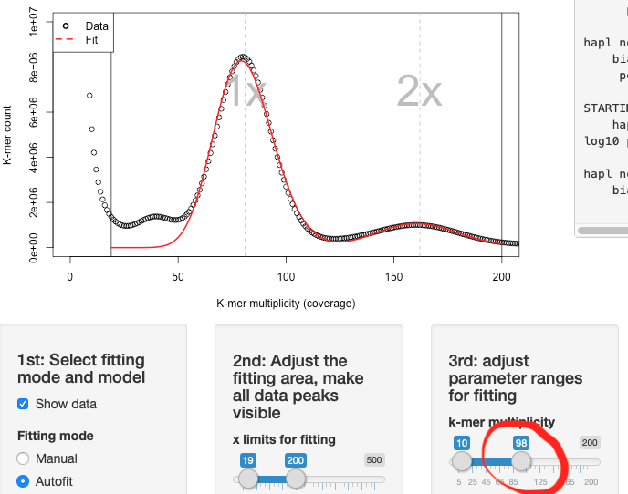
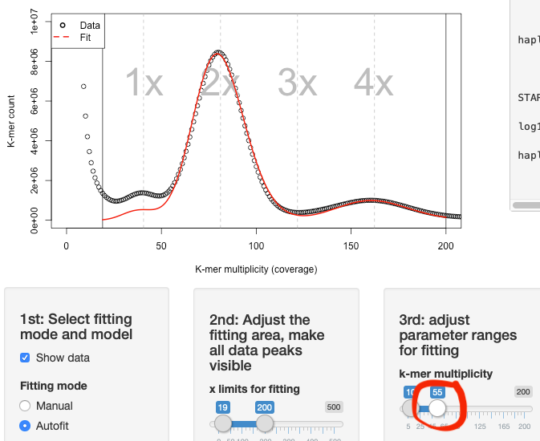

```{r, include = FALSE}
knitr::opts_chunk$set(
  collapse = TRUE,
  comment = "#>"
)
```

```{r setup}
library(Tetmer)
```

## Overview

The `tetmer()` function launches an interactive Shiny app for fitting
population genetic models to a k-mer spectrum. It requires the `shiny`
package (an optional dependency, listed under `Suggests`), and is best
run from an interactive R session, since it opens a local browser
window and blocks the console until you close it.

This vignette walks through the two fitting modes available in the
app: *Manual* mode and *Autofit* mode. The code chunks that launch the
app itself are not evaluated when this vignette is built, since doing
so would require an interactive graphical session. If you run them
yourself in RStudio or a normal R console, a window will pop up.

## Loading data

Tetmer ships with two example spectra so that you can try the app
without needing your own data. `E028` is an allotetraploid plant
(*Euphrasia arctica*), and `E030` is a diploid plant (*Euphrasia
anglica*):

```{r}
E028
E030
```

Both are `spectrum` objects (see the "The spectrum and tetmerFit
classes" vignette for details on this class). To use your own data
instead, read it in with `read.spectrum()`:

```{r, eval = FALSE}
mySpec <- read.spectrum("path/to/mySpectrumFile", nam = "My sample", k = 21)
```

## Launching the app

```{r, eval = FALSE}
result <- tetmer(E030)
```

The app opens with the spectrum plotted in the top-left panel and a
text summary in the top-right panel. Below that, a row of control
panels lets you choose the fitting mode, the ploidy/model, and the
relevant parameter ranges. Clicking **Done** closes the app and
returns an updated `spectrum` object -- with the current fit appended
to its `fits` slot if Autofit was used -- which is why the call above
assigns the result to `result`.

## Manual mode

Manual mode is useful for building intuition about how each parameter
shapes the expected k-mer spectrum, or for cases where Autofit
struggles to converge and a good starting point is needed.

Select **Manual** as the fitting mode, then choose a model (Diploid,
Triploid, or Tetraploid). Manual mode exposes single numeric inputs,
rather than ranges, for:

- the monoploid k-mer coverage,
- the variance factor (`vf`), which controls how wide the fitted peaks
  are relative to their mean -- the noisier the sequencing data, the
  wider the peaks,
- theta, the genome-wide heterozygosity per k-mer,
- the monoploid non-repetitive genome size (in Mbp).

For allopolyploid models, a further panel appears for the divergence
time between sub-genomes, expressed in units of 2*Ne*.

Because manual mode does not run any optimisation, changing a value
immediately redraws the fitted curve against the data, letting you see
the effect of each parameter directly.

## Autofit mode

Autofit is normally the fastest way to get a fit. Select **Autofit**
as the fitting mode, then set:

1. **The fitting range**, using the "x limits for fitting" slider.
   Most k-mer spectra include a *contamination peak* at low
   multiplicity, which should be excluded by moving the left handle of
   this slider past it -- otherwise it will dominate the fit and
   distort the parameter estimates. The right handle should be placed
   high enough to include all relevant peaks of the spectrum
   (roughly, ploidy times haploid sequencing coverage).
2. **Parameter ranges** for k-mer coverage, variance factor, theta, and
   genome size. Tetmer searches within these bounds for the
   combination that best matches the data.

If the range for the k-mer coverage is too wide, Tetmer can converge
on a multiple of the true coverage:



Narrowing the range around the expected coverage resolves this:



As a rule of thumb, the k-mer coverage should be somewhat lower than
the haploid sequencing coverage: `k-mer coverage = sequencing depth *
(read length - k-mer length) / read length`. If a fit still looks
poor, it is usually enough to slightly adjust the ranges rather than
switch models.

For allopolyploid models, a further slider sets the range for the
sub-genome divergence time, matching the equivalent single value in
manual mode.

## Saving the fit

Once you are satisfied with a fit obtained in Autofit mode, click
**Done**. The app closes and returns a `spectrum` object with the fit
recorded:

```{r, eval = FALSE}
result <- tetmer(E030)
result
```

You can inspect, export, or add further fits to this object using the
functions described in the other two vignettes: `fitSpectrum()` for
scripted, non-interactive fitting, and `addFit()` /
`write.spectrum()` for working with `spectrum` and `tetmerFit` objects
directly.
